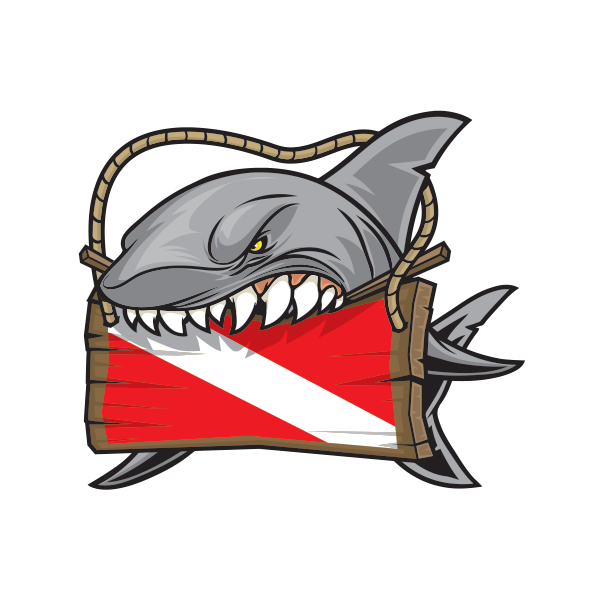
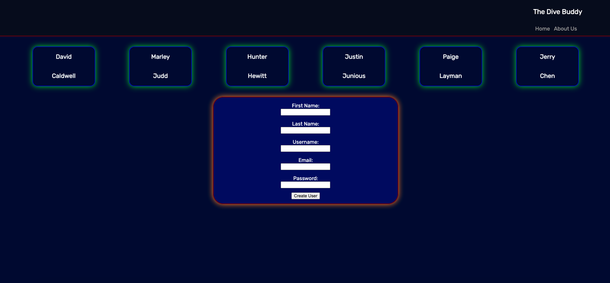
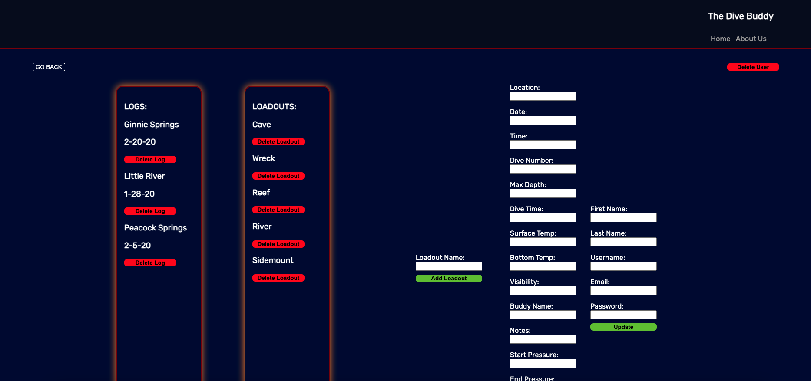
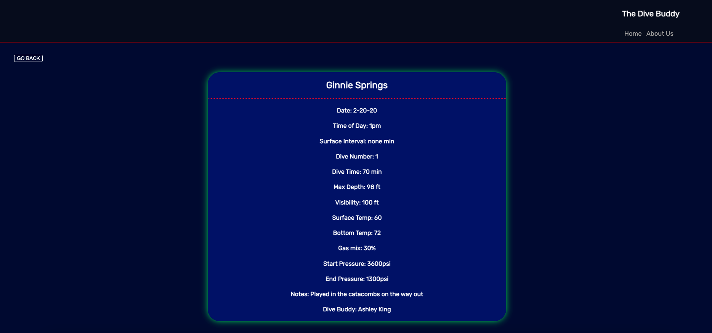
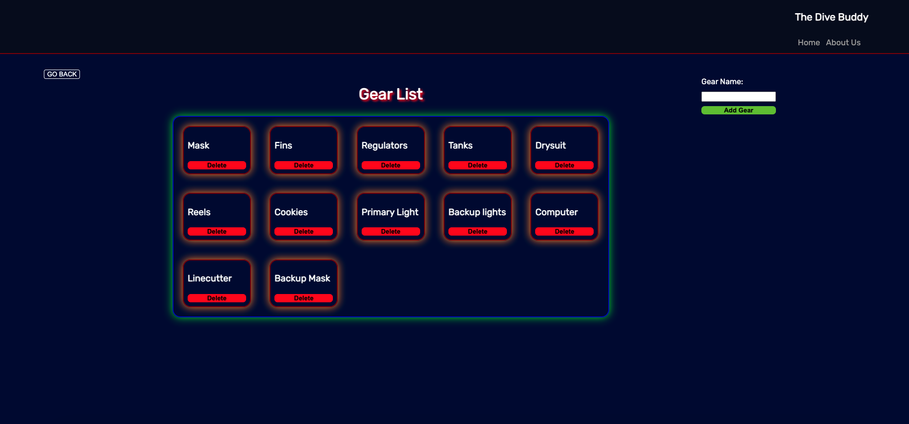

# The Dive Buddy

### by David Caldwell

### 12/15/2022

---

## Description:

The Dive Buddy app provides a place for divers to log their dives, add and edit loadouts, and view both.

#### \*built with Mongo, Express, React, and Node.

---

## How to get started

When you open this application you will land on the homepage. From there you can navigate to a diver of your choice to view their dive logs and loadouts. In dive logs you will be able to create a new log or get rid of a log that you don't want. If you are in the loadouts section you will be able to build a loadout and use it as a checklist for a dive trip.

- `Fork` and `Clone`
- `cd` into the new directory
- `npm install` to install dependencies
- run `npm run dev` in main directory
- run `npm start` in client directory

---

Links:

### [Heroku Deployment](https://the-dive-buddy.herokuapp.com/) | [GitHub](https://github.com/LeaderOfTheLost/the-dive-buddy) | [Trello-Board](https://trello.com/b/YNIfKMrZ/the-dive-buddy) | [CHD](./src/images/chd.png) | [ERD](./src/images/erd.png)

---

## Screenshots

Home

---

---

User "Profile"

---

---

Log

---

---

Loadout

---

---

### **_Future Updates_**

- [ ] Auth
- [ ] Post Feed
- [ ] Mobile Design
- [ ] Edit logs

---

Credits:

- [Shark image](https://www.stickers-factory.com/media/catalog/product/cache/1/image/1000x/040ec09b1e35df139433887a97daa66f/0/1/01471_00.png)
  Docs Used:

- [MDN Docs](https://developer.mozilla.org/en-US/)
- [W3Schools](https://www.w3schools.com/)

---
